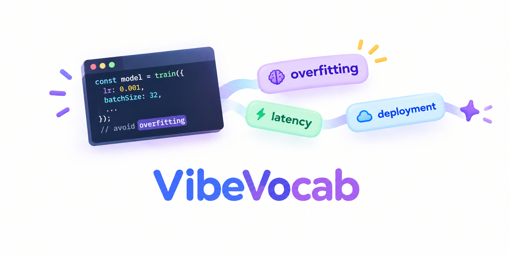

<p align="center">
  
</p>
<p align="center">
  익숙한 언어로 Vibe Coding, 영어는 그 김에<br>
  <em>Vibe-code in your own language. Pick up the English along the way</em>
</p>
<p align="center">
  <a href="../../LICENSE"></a>
  
  = 18">
</p>

<p align="center">
  🌐 <strong>언어</strong>:
  <a href="../../README.md#中文">🇨🇳 中文</a> ·
  <a href="../../README.md#english">🇬🇧 English</a> ·
  <a href="README.ja.md">🇯🇵 日本語</a> ·
  <strong>🇰🇷 한국어</strong>
</p>

---

### 한 줄로 말하면

모국어로 vibe coding 하고, Claude는 평소처럼 작업합니다. 유일한 차이는 각 답변에서 **가장 핵심적인 개념 하나**를 Claude가 영어 용어 그대로 두고, 처음 등장할 때만 짧은 주석을 붙인다는 것입니다. 그 이후로는 그대로 쓰고, 당신은 문맥에서 파악합니다. 진짜 용어를, 실제 맥락에서, 추가 시간 없이.

### 무엇이 달라지는가

같은 질문으로 비교해 보겠습니다: **"모델이 훈련 데이터에서는 99%, 테스트 데이터에서는 70%밖에 안 나와요. 어떻게 해야 하나요?"**

<table>
<tr>
<td width="50%">

#### 일반 Claude Code

> 전형적인 **过拟合(과적합)**입니다. 훈련 데이터에서는 잘 나오는데 테스트 데이터에서 이렇게 떨어진다는 건, 모델이 훈련 데이터의 노이즈까지 외워버렸다는 뜻입니다. **正则化(정규화)**를 추가하거나 **早停(조기 종료)**를 켜거나 **数据增强(데이터 증강)**을 시도해볼 수 있습니다. 훈련 데이터와 테스트 데이터의 분포가 일치하는지도 확인해볼 가치가 있습니다……

진단도 맞고 코드도 잘 동작합니다. 하지만 용어가 전부 한국어로 남아있어서, 다음에 영어 문서나 에러 로그, 컨퍼런스 발표를 볼 때 또 처음부터 찾아봐야 합니다.

</td>
<td width="50%">

#### VibeVocab을 켜면

> 전형적인 **overfitting(과적합)**입니다. 모델이 훈련 데이터의 노이즈까지 외워버렸습니다.
>
> 1. 해당 레이어에 L2 정규화를 추가하세요. `weight_decay=1e-4`부터 시작
> 2. 조기 종료를 켜고, train loss가 아니라 validation loss를 지켜보세요
> 3. 그래도 안 되면 data augmentation을 시도하세요
>
> 다음 단계: 지금의 train/val loss 그래프를 붙여넣어 주세요.

같은 진단 내용에 더해 `overfitting`이라는 단어와 그 단어가 등장한 실제 문장이 그대로 `vocab-log.md`에 저장됩니다.
다음번에는 Claude가 바로 `overfitting`이라고 씁니다 —— 이미 한 번 봤으니까요.

</td>
</tr>
</table>

오른쪽에서는 **단어 하나에만** 주석이 붙어 있습니다: `正则化`, `早停`, `数据增强`은 그대로입니다. 한 답변당 가장 핵심적인 개념 하나만. `/vocab rate`로 최대 5개까지 늘릴 수 있습니다.

별도의 앱도, 단어 암기 시간도 없고, 작업 흐름도 끊기지 않습니다 —— 백그라운드 hook이 `용어(주석)`을 조용히 모아 프로젝트 루트의 `vocab-log.md`에 기록합니다.

### 왜 효과가 있는가

- **추가 시간이 전혀 들지 않음** —— 단어를 외우는 게 아니라 코드를 짜고 있을 뿐입니다.
- **맥락과 함께 기억함** —— "overfitting = 과적합"이 아니라 "모델이 노이즈까지 외워버렸다, 이게 overfitting이다"를 기억하게 됩니다.
- **습득 원리에 맞음** —— 처음 한 번만 설명하고, 그 다음부터는 실제 사용 속에서 떠올리게 합니다. 플래시카드를 넘기는 것과는 다릅니다.
- **복습 가능** —— `vocab-log.md`는 그냥 Markdown 표입니다. `/vocab export`로 Anki에 보낼 수 있습니다.

전체 규칙은 `rules/vibe-vocab.md`에 있습니다 (활성화 시 세션에 주입): 답변마다 **가장 핵심적인** 개념 하나만 영어로 남기고, 처음 등장할 때 짧은 주석을 한 번 달고, 이후로는 그대로 사용한다. 코드, 주석, 제목에는 절대 달지 않는다.

### 설치

```
/plugin marketplace add /path/to/vibe-vocab
/plugin install vibe-vocab@vibe-vocab-local
/vocab on
```

- `/vocab on`은 현재 프로젝트에 활성화하고 현재 세션에서 바로 적용됩니다. `/vocab on always`는 전역 활성화.
- `/vocab off`로 비활성화. 잠시 조용히 하려면 "주석 달지 마" 또는 "focus"라고 말하면 됩니다.
- `claude`는 **프로젝트 루트**에서 실행하세요 —— `vocab-log.md`와 설정 파일은 실행한 디렉터리에 생기고, 하위 디렉터리로 상속되지 않습니다.
- 플러그인 파일을 수정한 뒤에는 `/plugin` → update.

### 조정

| 명령 | 역할 |
|---|---|
| `/vocab` | 단어장 요약: 개수, 모드, 현재 설정 |
| `/vocab rate <1-5>` | 답변당 주석 개수 (기본값 1, 상한 5 —— 그 이상은 단어장) |
| `/vocab level <beginner\|mid\|advanced>` | 기준: 일상적인 용어도 포함 / 어렴풋이 아는 용어 (기본값) / 정말 전문적인 용어만 |
| `/vocab know <용어…>` · `/vocab forget <용어…>` | "원래 알던 것, 주석 불필요"로 표시 / 취소. `/vocab know backend`로 단어팩 전체 표시 |
| `/vocab focus <분야>` | 액티브 모드: Claude가 해당 팩의 용어를 쓸 기회를 적극적으로 찾음 (`frontend` `backend` `ml` `or-stats` `devops`). `/vocab focus off`로 해제 |
| `/vocab export` | `vocab-anki.csv` 내보내기 (Anki / Excel / Google Sheets 용) |

설정은 프로젝트 루트에 저장되며 다음 세션부터 적용됩니다. 지금 적용하려면 해당 `/vocab` 명령을 다시 실행하세요. 명령에 `always`를 붙이면 모든 프로젝트의 기본값이 됩니다. `vocab-log.md`에 있는 용어는 다음 세션부터 자동으로 그대로 쓰이므로 `know`는 거의 필요 없습니다.

### 왜 만들었나

Vibe coding 덕분에 코드를 거의 쓰지 않고도 무언가를 만들 수 있게 됐습니다. 그래도 하루 종일 기술 영어에 둘러싸여 있죠 —— 문서, 에러, API 이름, 모델이 당신 프로젝트를 설명할 때 쓰는 단어들. "overfitting = 과적합"을 외우는 대신, 실제 문제를 풀다가 그 단어를 만나고, 내일 또 만나고, 어느새 번역하지 않게 됩니다. 만드세요. 언어는 그 과정에서 익히면 됩니다.

## 라이선스

MIT —— 무의식적으로 쓰게 된 단어를 하나라도 가르쳐줬다면 Star ⭐ 부탁드립니다.
